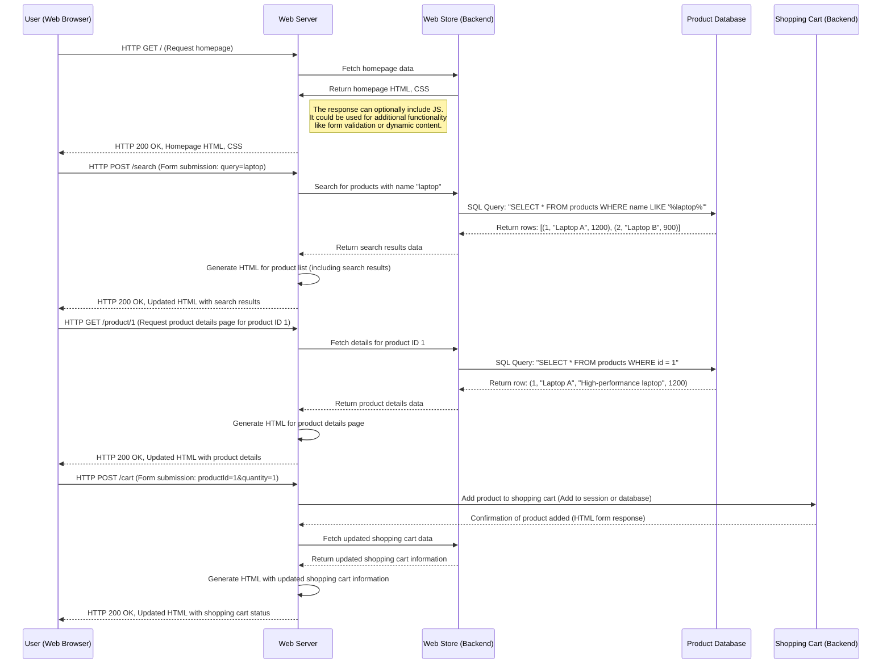
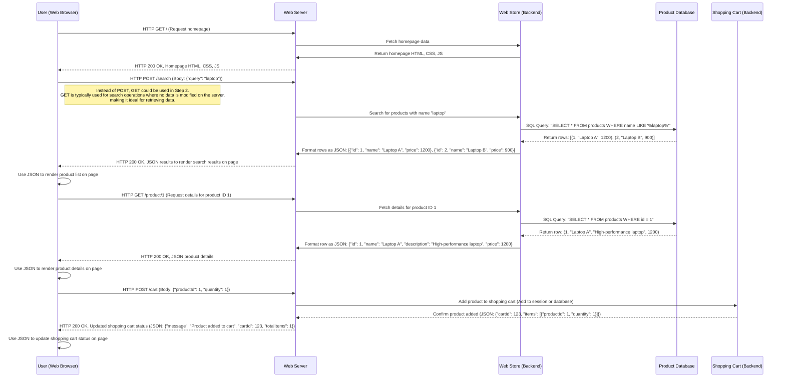

# Common Web architectures
## Web 1.0
The first web apps used the following approaches:
* HTML always served from backend;
* Interaction via links (GET) or web forms (GET, POST);
* Each user action requires full page reload.

Example of interaction:

## Single Page App (SPA)
In this case:
* Only initial page load gets HTML from backend;
* All subsequent interactions are rendered locally on frontend (in browser) using JavaScript browser APIs;
* All interactions are performed by sending HTTP requests (GET, POST, PUT, DELETE, possibly others) using JavaScript APIs (XHR, fetch);
* History API is used to simulate page changes in browser history.

Example of interaction:

